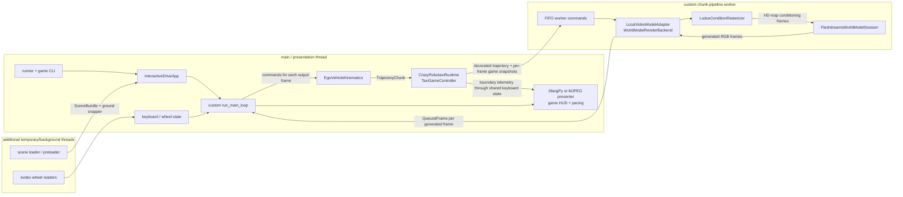
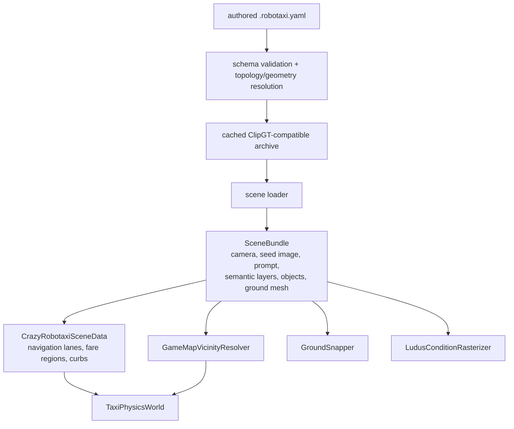
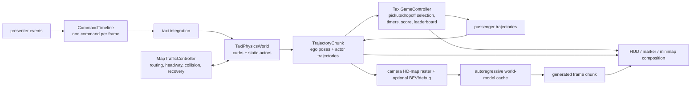

# Crazy Robotaxi map-branch architecture

This document records the as-built architecture on
`origin/dev/aidanf/game/crazy-robotaxi-map` as fetched at commit `f92deda`. It
is a behavioral reference for the rewrite, not a target implementation and not
a list of files to transplant. The earlier V2 porting attempt was not
consulted.

## Process and threading model

The old engine owns scheduling that FlashDreams V2 now owns. The main loop
polls the presenter, samples controls, simulates a complete model chunk, sends
that chunk through a private worker queue, drains generated frames from a
second queue, and presents them at a fixed cadence. A generation token drops
stale queued frames after resets or scene switches.

The presenter is more than a renderer: it owns or reads control state, HUD
state, view selection, scene selection, loading screens, game-over name entry,
and local/MJPEG output. Consequently, game state crosses from the simulation
path to presentation through mutable keyboard/presenter state.

## Scene and map preparation

The authored node graph is compiled into distinct runtime concepts:

- semantic surfaces and markings for model conditioning;
- directed navigation lanes and parking fare regions for route planning;
- curb and barrier geometry for physics;
- authored traffic tracks and spawn parameters;
- camera, seed-image, prompt, and ground-mesh data.

The private archive is a derived cache. The YAML remains the authoring format.

## Per-chunk game and model flow

`EgoVehicleKinematics.pose_chunk` is authoritative for motion. It advances the
taxi and PhysX once per requested output frame and returns synchronized poses,
timestamps, dynamic actors, collision information, and optional debug
geometry. `TaxiGameController` advances once per trajectory frame so fare and
HUD snapshots align with generated frames. Visible waiting passengers are
then added to the same trajectory used for model conditioning.

`MapTrafficController` owns the gameplay state of authored traffic. It selects
nearby traffic using the map vicinity, drives active PhysX actors along their
tracks, handles collision and recovery phases, and exposes their trajectories
to the rasterizer.

## Ownership and reset behavior

| Lifetime | As-built owner | State |
| --- | --- | --- |
| Process | `InteractiveDriveApp` / render backend | loaded world model, custom worker thread, scene cache, presenter |
| Selected scene | app + backend | `SceneBundle`, rasterizer geometry, prompt/image conditioning, ground snapper |
| Rollout | app main thread + backend worker | simulation, physics world, game controller, world-model cache |
| Presentation | presenter on main thread | input state, HUD state, view/scene selection, last frame |

A manual reset recreates simulation and game state and queues a backend cache
reset while retaining the loaded model and selected scene. A scene switch also
rebinds raster geometry and resets scene-specific conditioning.

## Architectural liabilities relevant to the rewrite

These are structural observations, not judgments about individual features:

- The engine duplicates runtime responsibilities now supplied by FlashDreams
  V2: worker lifecycle, event fan-out, pacing, reset generations, result
  buffering, frame dropping, and presentation.
- More than two long-lived runtime threads can exist.
- Mutable keyboard/presenter state is the implicit bridge between game logic,
  input, and presentation.
- `PresentedFrame` combines model output, conditioning/debug images, gameplay
  annotations, status text, and timing metadata.
- The world-model adapter reconstructs configuration and cache lifecycle around
  an older session abstraction instead of using the current pipeline contract
  directly.
- Native-window and MJPEG presenters duplicate substantial game-HUD behavior.

Those liabilities define what the V2 target design must remove while retaining
the game behavior described above.
