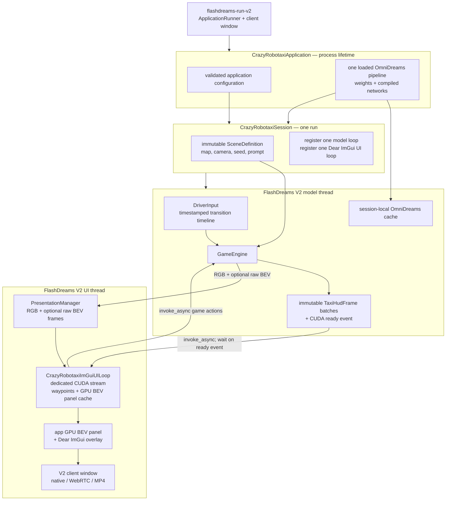
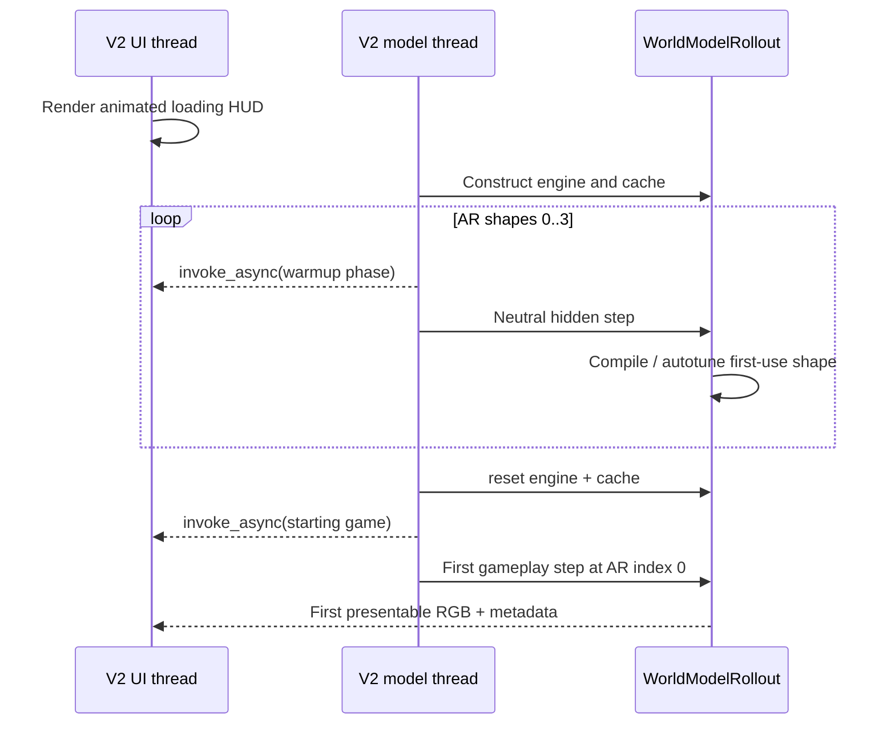
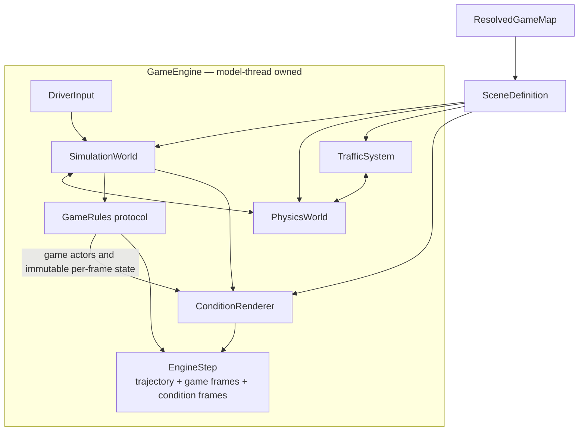
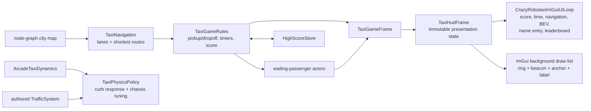
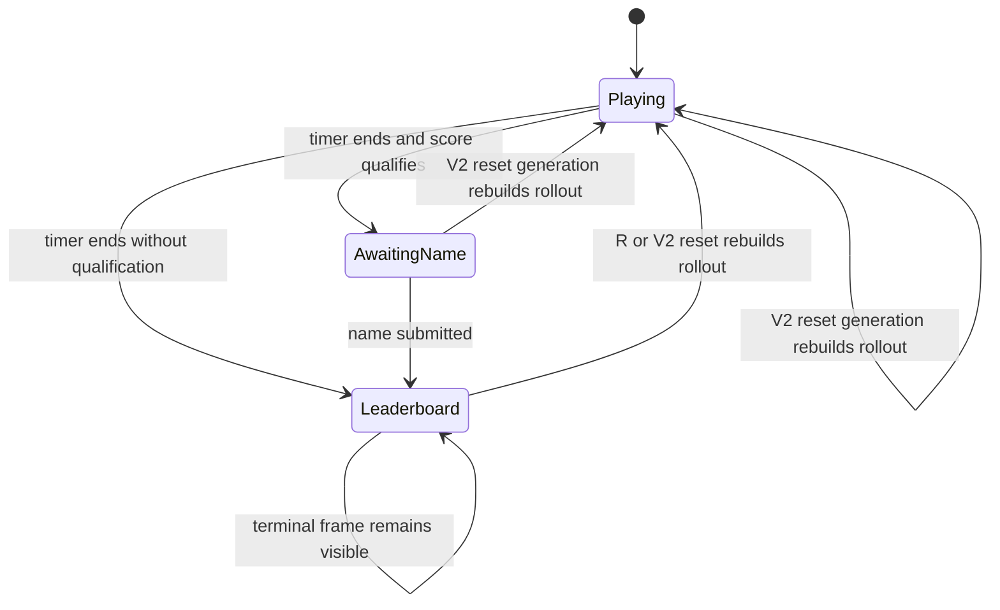

# Crazy Robotaxi target architecture for FlashDreams V2

This is the implementation guide for the ground-up rewrite. It was derived by
reconciling the current FlashDreams V2 contracts with the behavior recorded in
[`crazy_robotaxi_legacy_architecture.md`](crazy_robotaxi_legacy_architecture.md).
The map branch supplies behavioral details only; its runtime architecture is
not part of this design.

## Design rules

1. FlashDreams V2 owns the runtime loop, event fan-out, reset generation,
   buffering, pacing, client window, and shutdown sequence.
2. There are only two runtime threads: the V2 model thread and the V2 UI
   thread. No game loop, chunk worker, scene-loader worker, MJPEG server, or
   input-device worker is created by the game engine.
3. The model thread exclusively owns mutable simulation, game, conditioning,
   autoregressive-cache, and driving-input state.
4. The UI thread owns all HUD interaction state, name entry, and presentation.
   Immutable HUD frame batches cross from model to UI through V2
   `invoke_async`; neither thread reads the other's mutable state.
5. The loaded OmniDreams pipeline is application-owned and reusable; every
   session/rollout has its own cache and mutable resources.
6. Reset reconstructs all rollout state together. FlashDreams' generation
   counter discards pre-reset results already in the presentation buffer.
7. Authored maps remain data. Map compilation and preview are CPU tooling, not
   runtime scheduling infrastructure.

## Process ownership



`CrazyRobotaxiApplication.session_desc()` declares the trained output layout,
resolution, and frame rate before model loading. `init()` parses only
application-owned options. `create_session()` validates the requested
description, lazily constructs the shared pipeline, prepares immutable scene
data, and returns an uninitialized session.

The session registers a model loop and a `CrazyRobotaxiImGuiUILoop`. The model
loop emits generated RGB frames and, when configured, the synchronized raw
uint8 BEV frame. Because the BEV exists only inside a HUD window, session
creation caps its raster to the actual ImGui image extent while preserving an
authored aspect ratio; model HD-map conditioning retains full output
resolution. For each generated frame it publishes an immutable
`TaxiHudFrame` containing its game snapshot and camera pose to the UI loop with
`invoke_async`. Each batch also carries a CUDA event recorded after the model
outputs so the app-owned presentation stream waits for exactly that chunk,
rather than fencing Vulkan against later model work on the shared default
stream. The UI loop selects the metadata aligned with the currently presented
model frame and caches that frame's projected in-world waypoint geometry. It
submits rings, beacons, anchors, and labels to ImGui's background draw list,
beneath the HUD windows, without constructing a full-size waypoint tensor. It
uses an immediate Dear ImGui window to place and clip a GPU-composited BEV;
`ImGuiUILoop` composites that one UI layer over the world frame. UI callbacks
send validated game actions back to the model loop with `invoke_async`; they
never call game state directly.

## Pre-presentation startup



The default four hidden blocks cover the initial, cache-filling, and first
steady-state shapes of the chunk2/window6 model. They run on the model thread
while the independently paced UI thread continues rendering loading progress.
Process-lifetime compiled kernels and autotune results remain available after
warmup. Resetting the rollout before gameplay discards warmup simulation, game
rules, conditioning, and autoregressive-cache state. CUDA graphs whose kernels
reference that cache are safely re-armed against the fresh gameplay cache;
they are never replayed against stale warmup storage. `--prewarm-blocks 0`
preserves a direct cold-start path for diagnosis and comparison.

## Model-loop step

```mermaid
flowchart LR
    EVENTS["unread V2 input events"]
    REDUCE["DriverInput.reduce"]
    COUNT["pipeline.get_num_frames(step_index)"]
    COMMANDS["per-frame DriverCommand sequence"]
    SIM["SimulationWorld.pose_chunk"]
    RULES["GameRules.advance_frames"]
    SNAPSHOTS["GameFrame snapshots"]
    ACTORS["traffic + passenger actor trajectories"]
    CONDITION["ConditionRenderer.render"]
    TENSOR["HD-map tensor<br/>B,V,T,C,H,W"]
    GENERATE["pipeline.generate"]
    FINALIZE["pipeline.finalize"]
    POST["optional session-local postprocess stream"]
    BEV["raw BEV frames<br/>small synchronized UI result"]
    HUDFRAMES["immutable TaxiHudFrame batch<br/>snapshot + camera pose"]
    SEND["invoke_async(UI loop)"]
    RESULTS["list[StepResult]<br/>RGB + optional raw BEV"]

    EVENTS --> REDUCE
    COUNT --> COMMANDS
    REDUCE --> COMMANDS
    COMMANDS --> SIM
    SIM --> RULES
    RULES --> SNAPSHOTS
    SIM --> ACTORS
    RULES --> ACTORS
    ACTORS --> CONDITION
    SIM --> CONDITION
    CONDITION --> TENSOR --> GENERATE --> FINALIZE --> POST
    CONDITION --> BEV
    SNAPSHOTS --> HUDFRAMES
    SIM --> HUDFRAMES
    HUDFRAMES --> SEND
    POST --> RESULTS
    BEV --> RESULTS
```



The output-frame count is learned from the pipeline before simulation, so
simulation, conditioning, generated video, game snapshots, and immutable HUD
frames have one authoritative `T`. Input edges update retained held state and
their timestamps preserve transitions that arrive while a model step is in
flight. The next step maps those transitions onto its fixed-size command
sequence, coalescing sub-frame states and retaining the newest states if the
chunk cannot represent all of them. Steering and speed commands advance at the
simulation frame interval rather than once per model invocation.

The direct model contract is:

```text
cache = pipeline.initialize_cache(text, first_frame, view_names)
T = pipeline.get_num_frames(autoregressive_index)
engine_step = engine.step(commands[T])
trajectory = engine_step.trajectory
hdmap = condition_renderer.render(trajectory)       # [B,V,T,3,H,W]
video = pipeline.generate(autoregressive_index, cache, hdmap)
metrics = pipeline.finalize(autoregressive_index, cache)
invoke_async(ui_loop, publish_hud_frames(game_snapshots, poses, video))
return [video StepResult, optional raw_bev StepResult]
```

The UI loop uses V2's `ImGuiUILoop` and `presented_model_frames()`. It projects
waypoint geometry only when the presented frame changes and submits the cached
primitives to ImGui's background draw list each UI tick. A transparent ImGui
map window owns the BEV's layout, clipping, title, and border. The app normalizes
and resizes the small renderer-native BEV on its presentation CUDA stream, caches
that panel for repeated UI ticks, and writes it into the returned video before
the base loop composites the ImGui overlay. The BEV never reaches a host image
or requires a FlashDreams image-upload extension. There is no full-frame
waypoint or BEV layer, retained SlangPy widget tree, intermediate app renderer,
local adapter, model session, chunk request, private command queue, private frame
queue, or legacy `PresentedFrame` aggregate.

## Game-engine internals



The reusable engine defines narrow game-facing contracts:

- `GameRules` owns mutable rules state, advances it from a trajectory,
  contributes dynamic actors, and returns immutable per-frame snapshots.
- `VehicleDynamics` turns commands into proposed vehicle motion.
- `PhysicsWorld` resolves ego, static, and actor interactions and produces
  synchronized actor trajectories.
- `ConditionRenderer` converts a scene and `EngineStep` into model-ready HD-map
  frames plus optional renderer-native uint8 BEV data; the application
  publishes that data as a second synchronized result for the UI loop.
- `GameEngine` sequences these components; it knows nothing about taxi fares,
  leaderboards, application entry points, V2 windows, or model presets.

The initial implementation may use concrete engine classes where no second
implementation exists, but dependencies still point from generic engine code
to game-injected protocols, never from the engine into `crazy_robotaxi`.

## Crazy Robotaxi specialization



Taxi-specific code supplies the generic engine with arcade vehicle dynamics,
curb/chassis physics policy, map-derived navigation/fare regions, game rules,
passenger actors, persistent scores, and UI-thread ImGui controls. It does not
subclass a game-engine application host or presenter.

## State and lifetime table

| Lifetime / owner | State |
| --- | --- |
| Application | resolved pipeline configuration; one loaded OmniDreams pipeline |
| Session, immutable | validated session description; compiled/loaded scene definition; game configuration |
| Model loop, per reset generation | driving-input reducer; simulation/PhysX/traffic; game rules; condition renderer; OmniDreams cache; last generated frame; AR index |
| UI loop, per reset generation | immediate ImGui state; immutable HUD-frame lookup; waypoint projection and BEV pixel caches; name-entry buffer; validation messages |
| Outside runtime | authored map YAML; derived map cache; high-score file |

All simulation, condition-renderer, and world-model CUDA calls that mutate
per-rollout state occur on the model thread. The ImGui renderer creates and
uses its presentation resources only on the UI thread. Immutable scene arrays
may be prepared before thread startup, but the model-thread state factory
performs mutable condition-renderer, PhysX, game, and cache construction
lazily on its first `step`.

## Reset, terminal state, and close



While awaiting a name, no new world-model block is generated. The model loop
re-emits the last generated RGB frame and publishes an updated immutable HUD
frame; the UI loop replaces its cached waypoint projections from that metadata.
ImGui owns the editable name buffer and submits a validated name to the model
loop with `invoke_async`. A leaderboard does not finish the model loop: it keeps
the last generated frame visible so R can rebuild the rollout without closing
the client window. Only an explicit finite block limit or a client close ends
the run.

On reset, the model loop closes and recreates the simulation, traffic, rules,
condition renderer state, and autoregressive cache as one unit. On close, it
releases all session-local resources; application close releases the shared
pipeline.

## Legacy-to-V2 reconciliation

| Map-branch responsibility | V2 owner / replacement |
| --- | --- |
| `InteractiveDriveApp` lifecycle | `IApplication` + `ISession` |
| custom `run_main_loop` | `run_session` supplied by FlashDreams V2 |
| `ChunkPipeline` worker | V2 model loop |
| private command/frame queues | direct step call + `PresentationManager` |
| generation token on reset | V2 `EventBuffer` generation |
| presenter event polling | V2 client window and shared event buffer |
| presenter pacing and frame replay/drop | V2 UI loop + presentation mode |
| `FlashdreamsWorldModelSession` | direct OmniDreams pipeline cache API |
| `PresentedFrame` metadata bundle | typed engine results plus immutable `TaxiHudFrame` messages |
| keyboard telemetry shared with presenter | UI-owned ImGui input plus `invoke_async` game actions |
| native/MJPEG presenters | V2 client-window modes |
| application-internal scene switching | map/variant application arguments; a different scene starts a new session |
| manual reset queueing | V2 reset event and loop `reset()` |

## Implemented package boundary

```text
apps/omnidreams_game_engine/
  omnidreams_game_engine/
    engine.py                 # GameEngine and EngineStep
    contracts.py              # injected game/dynamics/physics contracts
    model.py                  # direct OmniDreams rollout bridge
    scene.py                  # immutable runtime scene loading
    input.py                  # V2 event reduction to per-frame commands
    conditioning.py           # Ludus conditioning boundary
    simulation/               # generic kinematics, PhysX, traffic
    game_map/                 # authored-map schema/compiler/runtime types

apps/crazy_robotaxi/
  crazy_robotaxi/
    application.py            # IApplication composition root
    session.py                # ISession + model/UI loop wiring
    ui.py                     # Dear ImGui HUD state and UI loop
    world_overlay.py          # ImGui world-marker projection and draw geometry
    rules.py                  # taxi fare state machine
    dynamics.py               # arcade taxi controls
    physics.py                # taxi collision policy
    navigation.py             # map-derived routes/fare sampling
    passengers.py             # conditioning actors
    high_scores.py            # persistent leaderboard
    config.py                 # strict game configuration
    map_tool.py               # offline validate/compile/preview command
```

Runtime responsibilities must remain in the blocks shown here. In particular,
the implementation must not introduce a second application host, custom
runtime loop, worker queue, or presenter abstraction.
