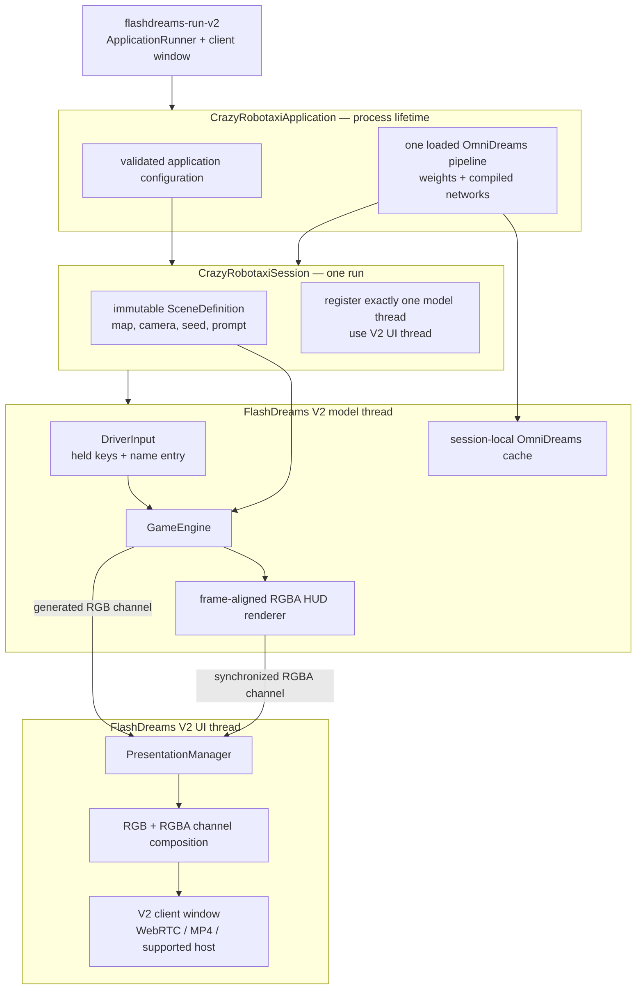
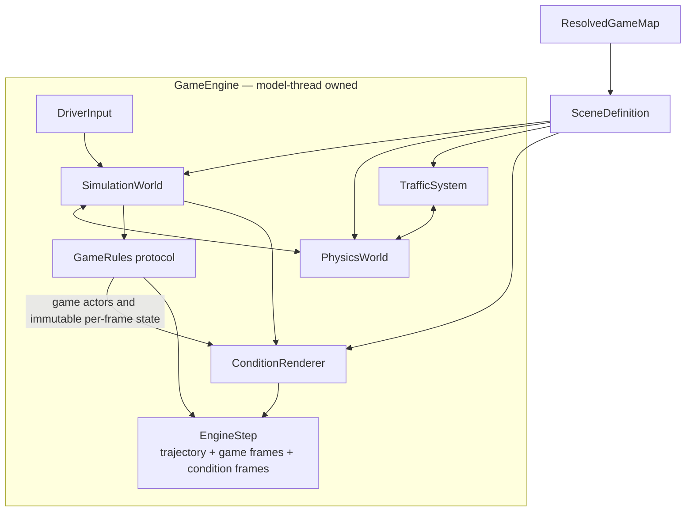
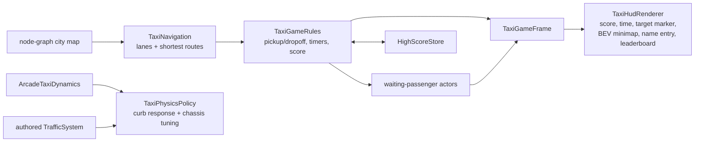
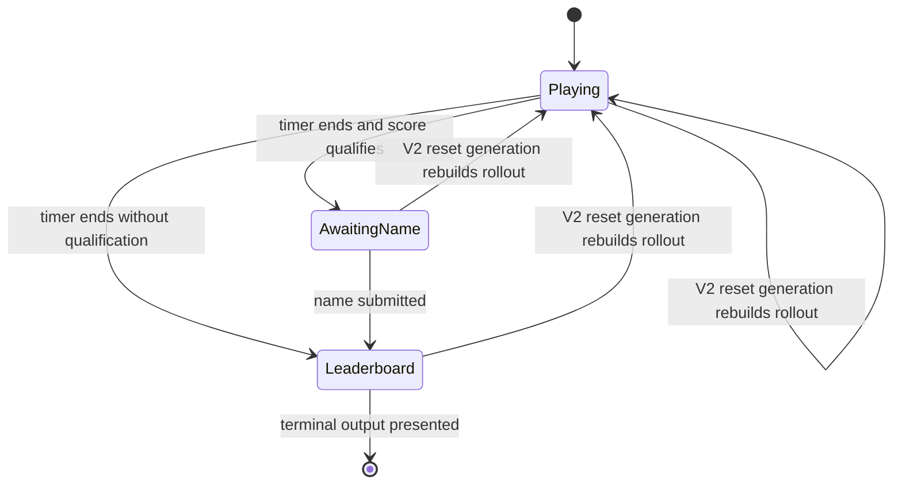

# Crazy Robotaxi target architecture for FlashDreams V2

This is the implementation guide for the ground-up rewrite. It was derived by
reconciling the current FlashDreams V2 contracts with the behavior recorded in
[`crazy_robotaxi_legacy_architecture.md`](crazy_robotaxi_legacy_architecture.md).
The map branch supplies behavioral details only; its runtime architecture is
not part of this design.

## Design rules

1. FlashDreams V2 owns the runtime loop, event fan-out, reset generation,
   buffering, pacing, client window, and shutdown sequence.
2. There are only two runtime threads: the V2 model thread and the V2 UI
   thread. No game loop, chunk worker, scene-loader worker, MJPEG server, or
   input-device worker is created by the game engine.
3. The model thread exclusively owns mutable simulation, game, conditioning,
   autoregressive-cache, input-reducer, and frame-snapshot state.
4. The UI thread never reads model-thread state. Frame-aligned presentation
   data crosses the boundary only as `StepResult` channels.
5. The loaded OmniDreams pipeline is application-owned and reusable; every
   session/rollout has its own cache and mutable resources.
6. Reset reconstructs all rollout state together. FlashDreams' generation
   counter discards pre-reset results already in the presentation buffer.
7. Authored maps remain data. Map compilation and preview are CPU tooling, not
   runtime scheduling infrastructure.

## Process ownership



`CrazyRobotaxiApplication.session_desc()` declares the trained output layout,
resolution, and frame rate before model loading. `init()` parses only
application-owned options. `create_session()` validates the requested
description, lazily constructs the shared pipeline, prepares immutable scene
data, and returns an uninitialized session.

The session registers a model thread. The standard V2 blit UI is sufficient
because the model thread emits bottom-to-top RGB and RGBA channels with equal
frame counts. If a custom UI is later required, it must preserve this channel
contract and communicate changes through V2 events or `invoke_async`; it may
not reach into model state.

## Model-thread step

```mermaid
flowchart LR
    EVENTS["unread V2 input events"]
    REDUCE["DriverInput.reduce"]
    COUNT["pipeline.get_num_frames(step_index)"]
    COMMANDS["per-frame DriverCommand sequence"]
    SIM["SimulationWorld.pose_chunk"]
    RULES["GameRules.advance_frames"]
    SNAPSHOTS["GameFrame snapshots"]
    ACTORS["traffic + passenger actor trajectories"]
    CONDITION["ConditionRenderer.render"]
    TENSOR["HD-map tensor<br/>B,V,T,C,H,W"]
    GENERATE["pipeline.generate"]
    FINALIZE["pipeline.finalize"]
    POST["optional session-local postprocess stream"]
    HUD["render_hud"]
    RESULTS["list[StepResult]<br/>RGB video, RGBA HUD"]

    EVENTS --> REDUCE
    COUNT --> COMMANDS
    REDUCE --> COMMANDS
    COMMANDS --> SIM
    SIM --> RULES
    RULES --> SNAPSHOTS
    SIM --> ACTORS
    RULES --> ACTORS
    ACTORS --> CONDITION
    SIM --> CONDITION
    CONDITION --> TENSOR --> GENERATE --> FINALIZE --> POST
    SNAPSHOTS --> HUD
    CONDITION --> HUD
    POST --> RESULTS
    HUD --> RESULTS
```



The output-frame count is learned from the pipeline before simulation, so
simulation, conditioning, generated video, game snapshots, and HUD layers have
one authoritative `T`. Input edges update retained held state; steering and
speed commands are advanced at the simulation frame interval to produce a
command for every frame rather than one command per model invocation.

The direct model contract is:

```text
cache = pipeline.initialize_cache(text, first_frame, view_names)
T = pipeline.get_num_frames(autoregressive_index)
engine_step = engine.step(commands[T])
trajectory = engine_step.trajectory
hdmap = condition_renderer.render(trajectory)       # [B,V,T,3,H,W]
video = pipeline.generate(autoregressive_index, cache, hdmap)
metrics = pipeline.finalize(autoregressive_index, cache)
return [video StepResult, HUD StepResult]
```

There is no intermediate render backend, local adapter, model session, chunk
request, command queue, frame queue, or `PresentedFrame` aggregate.

## Game-engine internals



The reusable engine defines narrow game-facing contracts:

- `GameRules` owns mutable rules state, advances it from a trajectory,
  contributes dynamic actors, and returns immutable per-frame snapshots.
- `VehicleDynamics` turns commands into proposed vehicle motion.
- `PhysicsWorld` resolves ego, static, and actor interactions and produces
  synchronized actor trajectories.
- `ConditionRenderer` converts a scene and `EngineStep` into model-ready HD-map
  frames plus optional BEV data used by the HUD.
- `GameEngine` sequences these components; it knows nothing about taxi fares,
  leaderboards, application entry points, V2 windows, or model presets.

The initial implementation may use concrete engine classes where no second
implementation exists, but dependencies still point from generic engine code
to game-injected protocols, never from the engine into `crazy_robotaxi`.

## Crazy Robotaxi specialization



Taxi-specific code supplies the generic engine with arcade vehicle dynamics,
curb/chassis physics policy, map-derived navigation/fare regions, game rules,
passenger actors, persistent scores, and HUD rendering. It does not subclass a
game-engine application host or presenter.

## State and lifetime table

| Lifetime / owner | State |
| --- | --- |
| Application | resolved pipeline configuration; one loaded OmniDreams pipeline |
| Session, immutable | validated session description; compiled/loaded scene definition; game configuration |
| Model thread, per reset generation | input reducer; simulation/PhysX/traffic; game rules; condition renderer; OmniDreams cache; last generated frame; AR index |
| UI thread | V2 presentation position and client-window state only |
| Outside runtime | authored map YAML; derived map cache; high-score file |

All CUDA/renderer calls that mutate per-rollout state occur on the model
thread. Immutable scene arrays may be prepared before thread startup, but the
model-thread state factory performs mutable renderer, PhysX, game, and cache
construction lazily on its first `step`.

## Reset, terminal state, and close



While awaiting a name, no new world-model block is generated. The model thread
re-emits the last generated RGB frame with a newly rendered one-frame HUD layer
until submission. It reports `is_finished()` only after a leaderboard frame has
been emitted (or an explicit finite block limit is reached), allowing MP4 mode
to terminate without a client close event.

On reset, the model thread closes and recreates the simulation, traffic, rules,
condition renderer state, and autoregressive cache as one unit. On close, it
releases all session-local resources; application close releases the shared
pipeline.

## Legacy-to-V2 reconciliation

| Map-branch responsibility | V2 owner / replacement |
| --- | --- |
| `InteractiveDriveApp` lifecycle | `IApplication` + `ISession` |
| custom `run_main_loop` | `run_session` supplied by FlashDreams V2 |
| `ChunkPipeline` worker | V2 model thread |
| private command/frame queues | direct step call + `PresentationManager` |
| generation token on reset | V2 `EventBuffer` generation |
| presenter event polling | V2 client window and shared event buffer |
| presenter pacing and frame replay/drop | V2 UI thread + presentation mode |
| `FlashdreamsWorldModelSession` | direct OmniDreams pipeline cache API |
| `PresentedFrame` metadata bundle | typed engine results plus synchronized output channels |
| keyboard telemetry shared with presenter | immutable `TaxiGameSnapshot` rendered to RGBA |
| native/MJPEG presenters | V2 client-window modes |
| application-internal scene switching | map/variant application arguments; a different scene starts a new session |
| manual reset queueing | V2 reset event and thread `reset()` |

## Implemented package boundary

```text
apps/omnidreams_game_engine/
  omnidreams_game_engine/
    engine.py                 # GameEngine and EngineStep
    contracts.py              # injected game/dynamics/physics contracts
    model.py                  # direct OmniDreams rollout bridge
    scene.py                  # immutable runtime scene loading
    input.py                  # V2 event reduction to per-frame commands
    conditioning.py           # Ludus conditioning boundary
    simulation/               # generic kinematics, PhysX, traffic
    game_map/                 # authored-map schema/compiler/runtime types

apps/crazy_robotaxi/
  crazy_robotaxi/
    application.py            # IApplication composition root
    session.py                # ISession + model thread
    rules.py                  # taxi fare state machine
    dynamics.py               # arcade taxi controls
    physics.py                # taxi collision policy
    navigation.py             # map-derived routes/fare sampling
    passengers.py             # conditioning actors
    high_scores.py            # persistent leaderboard
    hud.py                    # synchronized RGBA game layer
    config.py                 # strict game configuration
    map_tool.py               # offline validate/compile/preview command
```

Runtime responsibilities must remain in the blocks shown here. In particular,
the implementation must not introduce a second application host, custom
runtime loop, worker queue, or presenter abstraction.
